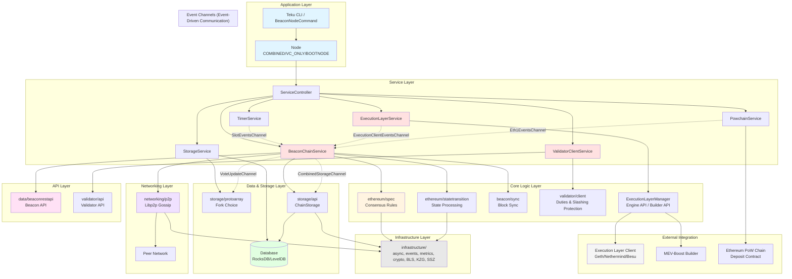

# CLAUDE.md

This file provides guidance to Claude Code (claude.ai/code) when working with code in this repository.

## Project Overview

Teku is an open-source Ethereum consensus client written in Java, implementing a full beacon node and validator client. It is written in Java 21+ and follows the Ethereum consensus specifications.

## Build and Development Commands

### Building
```bash
# Full build with tests
./gradlew build

# Build without tests
./gradlew assemble

# Create distribution packages
./gradlew distTar installDist

# Build Docker image
./gradlew distDocker
```

### Code Style
```bash
# Apply Google Java code formatting (required before committing)
./gradlew spotlessApply

# Check code formatting
./gradlew spotlessCheck
```

### Testing
```bash
# Run all unit tests
./gradlew test

# Run tests for a specific module (example)
./gradlew :ethereum:spec:test

# Run integration tests
./gradlew integrationTest

# Run reference tests (consensus spec tests)
./gradlew referenceTest

# Run acceptance tests
./gradlew acceptanceTest

# Run property tests
./gradlew propertyTest
```

### Distribution
The built distribution is located in:
- Packaged: `build/distributions/`
- Expanded (ready to run): `build/install/teku/`

## Architecture Overview

### High-Level Architecture Diagram



### Module Dependency Layers

```
┌─────────────────────────────────────────────────────────────┐
│  teku/                    (Application Entry Point)         │
└────────────────────────────┬────────────────────────────────┘
                             │
┌────────────────────────────┴────────────────────────────────┐
│  services/         (Service Orchestration Layer)            │
│  ├─ beaconchain, chainstorage, executionlayer               │
│  ├─ powchain, timer, bootnode, zkchain                      │
└────────────┬──────────────────────────┬─────────────────────┘
             │                          │
┌────────────┴──────────┐  ┌───────────┴──────────────────────┐
│  validator/           │  │  beacon/                          │
│  ├─ client            │  │  ├─ pow, sync, validator          │
│  ├─ api               │  │                                   │
│  └─ beaconnode        │  └───────────────────────────────────┘
└───────────┬───────────┘
            │
┌───────────┴─────────────────────────────────────────────────┐
│  ethereum/              (Core Consensus Layer)              │
│  ├─ spec               (Consensus specification)            │
│  ├─ statetransition    (Block/slot processing)              │
│  ├─ executionlayer     (EL integration)                     │
│  ├─ dataproviders      (Data queries)                       │
│  ├─ networks           (Network configs)                    │
│  └─ weaksubjectivity   (Checkpoint validation)              │
└─────────┬──────────────────────────┬────────────────────────┘
          │                          │
┌─────────┴──────────┐  ┌───────────┴──────────────────┐
│  storage/          │  │  networking/                  │
│  ├─ api            │  │  ├─ p2p (Libp2p)             │
│  ├─ protoarray     │  │  ├─ eth2 (Protocol)          │
│  └─ archive        │  │  └─ nat                       │
└─────────┬──────────┘  └──────────┬───────────────────┘
          │                        │
┌─────────┴────────────────────────┴───────────────────────────┐
│  data/                  (REST API & Serialization)           │
│  ├─ beaconrestapi      (Beacon Chain REST API)               │
│  ├─ provider           (Data providers)                      │
│  ├─ serializer         (SSZ/JSON serialization)              │
│  └─ publisher          (Metrics publishing)                  │
└──────────────────────────┬───────────────────────────────────┘
                           │
┌──────────────────────────┴───────────────────────────────────┐
│  infrastructure/           (Foundation Layer)                │
│  ├─ async, events, metrics, logging                          │
│  ├─ bls, kzg, crypto                                         │
│  ├─ ssz (serialization)                                      │
│  ├─ bytes, collections, unsigned                             │
│  └─ http, restapi, serviceutils, time, yaml                 │
└──────────────────────────────────────────────────────────────┘
```

### Application Modes

Teku supports three operational modes controlled by `NodeMode`:
1. **COMBINED**: Full beacon node + validator client (default)
2. **VC_ONLY**: Validator client only (connects to remote beacon node)
3. **BOOTNODE_ONLY**: Network bootstrap node only

Entry point: `teku/src/main/java/tech/pegasys/teku/Teku.java`
CLI parsing: `teku/src/main/java/tech/pegasys/teku/cli/BeaconNodeCommand.java`

### Service-Based Architecture

Teku uses a composable service architecture where all major components are `Service` implementations managed by `ServiceController`. Services start in dependency order and stop in reverse order:

```
ServiceController
├─ StorageService (database and state storage)
├─ ExecutionLayerService (Execution Layer integration)
├─ BeaconChainService (consensus layer processing)
├─ PowchainService (PoW chain monitoring for deposits)
├─ ValidatorClientService (validator duties)
└─ TimerService (slot timing)
```

### Key Modules

**ethereum/spec** - Core consensus specification implementation
- Organized by milestones: PHASE0, ALTAIR, BELLATRIX, CAPELLA, DENEB, FULU, GLOAS
- `Spec.java` provides unified API across all forks
- `SpecVersion.java` encapsulates version-specific operations
- `ForkSchedule.java` determines which fork rules apply at each epoch

**beacon/** - Beacon chain functionality
- `beacon:pow` - Proof-of-Work chain interaction
- `beacon:sync` - Block synchronization logic
- `beacon:validator` - Validator-specific beacon operations

**ethereum/statetransition** - State transition logic
- Processes blocks, slots, attestations according to consensus rules
- Validates and applies state changes

**ethereum/executionlayer** - Execution Layer integration
- `ExecutionLayerManager` orchestrates EL interactions
- `ExecutionEngineClient` implements Engine API (newPayload, forkchoiceUpdated)
- `BuilderClient` integrates with MEV-Boost builders
- Supports Web3j and REST transport layers

**storage/** - Database and state management
- Multiple storage modes: ARCHIVE, PRUNE_ANCIENT_STATES, PRUNE_HOT_STATES
- Supports RocksDB and LevelDB backends
- `storage:protoarray` implements fork choice algorithm
- `storage:archive` handles historical data (blobs, etc.)

**data/beaconrestapi** - REST API implementation
- Implements standard Beacon Chain API endpoints
- Separate validator API endpoints

**networking/** - Peer-to-peer networking
- `networking:p2p` - Libp2p integration for gossip and discovery
- `networking:eth2` - Ethereum 2.0 protocol-specific networking
- Handles peer management, attestation/block propagation

**validator/** - Validator client
- `validator:client` - Validator duties, slashing protection
- `validator:api` - REST API for external validator clients
- `validator:beaconnode` - Beacon node client interface

**infrastructure/** - Shared utilities
- async, events, metrics, logging, crypto, BLS, KZG
- SSZ serialization (`infrastructure:ssz`)
- Event channels for inter-service communication

### Event-Driven Communication

The system uses an event-driven architecture via `EventChannels`:

- **SlotEventsChannel** - Fires every slot (12 seconds), drives consensus processing
- **VoteUpdateChannel** - Fork choice updates
- **CombinedStorageChannel** - Storage state updates
- **ExecutionClientEventsChannel** - Execution Layer events
- **Eth1EventsChannel** - PoW chain events (deposits)

Services subscribe to relevant channels and react asynchronously using `SafeFuture` for non-blocking operations.

### State Transition Flow

1. **SlotEventsChannel.onSlot()** fires every 12 seconds
2. **BeaconChainService** processes the slot:
    - Performs per-slot state transition
    - Processes pending attestations
    - Triggers block proposal if validator's duty
3. **ExecutionLayerManager** queried for execution payload (if proposing)
4. **Fork choice** updated via VoteUpdateChannel → BatchingVoteUpdateChannel
5. **Network layer** gossips blocks/attestations to peers
6. **Storage** persists finalized states and blocks

### Consensus Specification Milestones

The codebase supports multiple Ethereum consensus forks. Each milestone has:
- Fork-specific `SpecConfig` (e.g., `AltairSpecConfig`, `CapellaSpecConfig`)
- Milestone-specific data structures (BeaconState, BeaconBlock variants)
- State transition logic adapted for the fork

`ForkSchedule` determines which milestone is active at each epoch, and `Spec` provides version-appropriate implementations.

### Execution Layer Integration

Teku integrates with Execution Layer clients (Geth, Nethermind, Besu, etc.) via:
- **Engine API**: newPayload, forkchoiceUpdated, getPayload
- **Builder API**: MEV-Boost integration for block building
- **Web3 API**: eth_* methods for legacy PoW monitoring

The `ExecutionLayerManager` abstracts these interactions and handles fallback/retry logic.

### Testing Strategy

- **Unit tests**: Test individual components in isolation (run with `./gradlew test`)
- **Integration tests**: Test component interactions (run with `./gradlew integrationTest`)
- **Reference tests**: Official Ethereum consensus spec tests (run with `./gradlew referenceTest`)
- **Acceptance tests**: End-to-end scenarios with real network simulation (run with `./gradlew acceptanceTest`)
- **Property tests**: Randomized property-based tests (run with `./gradlew propertyTest`)

Each module has its own test suite under `src/test/java` and test fixtures under `src/testFixtures/java`.

## Code Conventions

- **Coding style**: Google Java conventions (enforced by Spotless)
- **Async operations**: Use `SafeFuture` and `AsyncRunner` instead of raw CompletableFuture
- **Immutability**: Prefer immutable data structures (record types, SszData implementations)
- **Error handling**: Use checked exceptions for recoverable errors, unchecked for programming errors
- **Testing**: All code must have automated test coverage (no manual tests).
- **Logging**: Add appropriate LOG lines for new code paths, following the Hyperledger Besu Coding Conventions.
- **Commit messages**: Imperative mood, present tense ("Add feature" not "Added feature")

See [Hyperledger Besu Coding Conventions](https://wiki.hyperledger.org/display/BESU/Coding+Conventions) for additional guidelines.

## Important Files

- `settings.gradle` - Defines all 75+ submodules
- `build.gradle` - Root build configuration, dependency management
- `CONTRIBUTING.md` - Contribution guidelines and CLA process
- `ethereum/spec/src/main/java/tech/pegasys/teku/spec/Spec.java` - Main consensus spec API
- `teku/src/main/java/tech/pegasys/teku/Teku.java` - Application entry point
- `services/beaconchain/src/main/java/tech/pegasys/teku/services/beaconchain/BeaconChainService.java` - Core beacon chain service

## Module Dependencies

The codebase enforces layered dependencies:
1. **infrastructure/** - Lowest level, no dependencies on other Teku modules
2. **ethereum/spec** - Depends only on infrastructure
3. **ethereum/*** - Can depend on infrastructure and other ethereum modules
4. **services/** - Composes ethereum, storage, networking modules
5. **teku/** - Top-level orchestration, depends on services

Circular dependencies are prevented by build-time dependency checks (DepCheckPlugin).

## Development Workflow

1. Make changes to relevant module(s)
2. Write unit tests for all code changes
3. Run `./gradlew spotlessApply` to format code
4. Verify compilation: `./gradlew compileJava compileTestJava compileJmhJava compileIntegrationTestJava compileAcceptanceTestJava compilePropertyTestJava`
5. Run unit tests: `./gradlew test`
6. Run module-specific tests: `./gradlew :<module>:test`
7. Run full build before committing: `./gradlew build`

## Running Teku Locally

After building with `./gradlew installDist`, run:
```bash
./build/install/teku/bin/teku --help
```